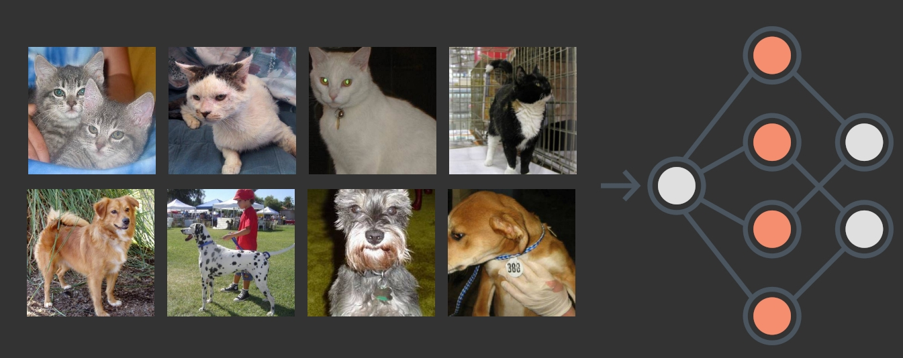
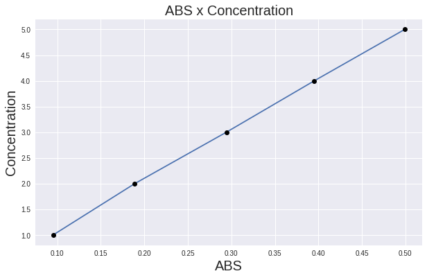

# Selected projects in Data Science and Machine Learning

---

## Image Classification

  
[**Link to notebook**](projects/image_classification/image_classification.ipynb)

This first project is about image classification, a model with ResNet50 architecture with imagenet weights was trained with 20.000 images of cats and dogs (10.000 for each class).
  

  
The model was trained for 5 epochs.
After training, 5.000 images were used for validation.  
**Loss:** 0.04524622857570648  
**Accuracy:** 0.9847999811172485
  
The obtained classification model was converted to the ONNX format, the model in this format is an excellent option to deploy, the model file is not only lighter, but also has a shorter inference time when compared to the standard tensorflow format.

---
## Linear regression

  
[**Link to notebook**](projects/linear_regression/linear_regression_chemistry.ipynb)
  
In college, linear regression was one of my first contacts with statistics and machine learning, linear regression is widely used in chemistry in the analytical area, where we use reagents with known concentrations to obtain their corresponding signal in equipment, and thus be able to generate a linear regression with these data, in order to be able to find the concentration of other samples in the future.

  
The **concentration** is the unit that tells us how much of that analyte is in a defined volume, the most used concentration unit is mol per liter (mol/L) or Molar (M), but other units of concentration such as milligrams per liter (mg/L) are also widely used.

**ABS** refers to absorbance, it is a value that goes from 0 to 1, this value tells us how much our analyte absorbs light at a certain wavelength, where 0 would be the absorbance of the matrix (usually distilled water) and 1 would be the value of the completely interrupted light beam.

Calibration curve values (or regression)  
**Concentration** = 9.8576 * ABS + 0.0961  
**R-square** = 0.999683
___
<!-- ## Data Analysis

  
[**Link to notebook**](projects/linear_regression/linear_regression_chemistry.ipynb) -->